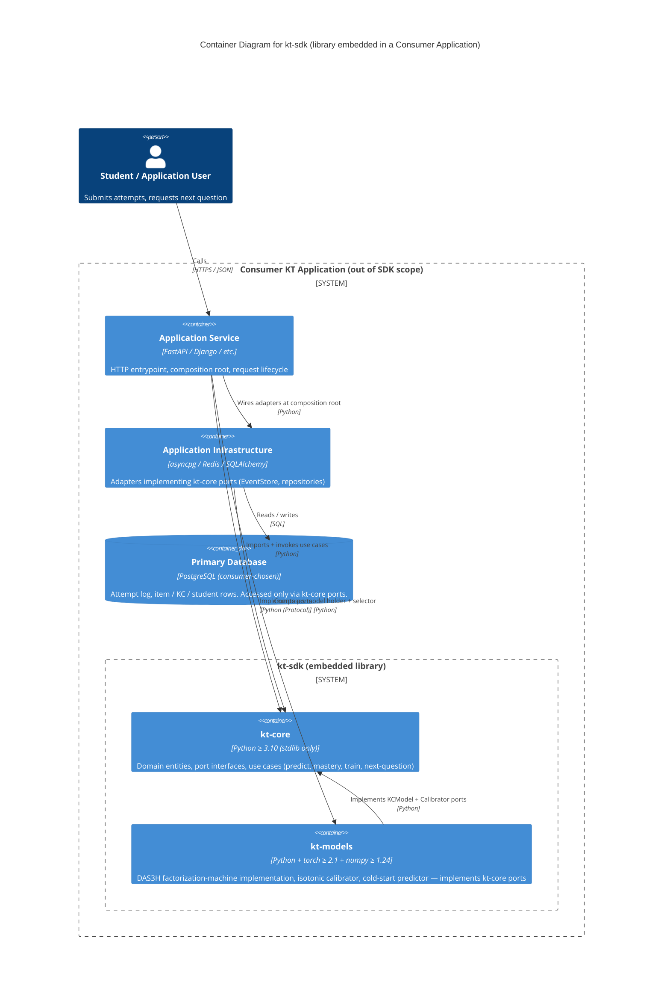

# Container Diagram — kt-sdk

> **C4 Level 2** — the system broken down into deployable/runnable containers. Audience: the dev team.
>
> **kt-sdk is a Python library, not a deployed system.** Strict C4 L2 ("deployable / runnable containers") doesn't apply directly. This diagram instead shows the **embedding shape**: how a consumer application composes the two SDK packages, the dependency direction between them, and where the external infrastructure boundary sits (everything outside the dotted SDK boundary is the application's responsibility, not the library's).

## Diagram

> **Note**: this diagram was auto-generated by /handover on 2026-05-21 from repo signals (README.md, two pyproject.toml files, agdd.md, kt_core/ and kt_models/ subdir layout). It is a **starting point** — review and refine.
>
> - kt-sdk has no deployable containers of its own — the two SDK boxes are Python packages, not runtimes
> - The "Consumer KT Application" boundary is illustrative — the SDK README references `kt-infra/` and `kt-service/` as the canonical examples but those are separate, app-specific repos not yet registered
> - The PostgreSQL choice in the diagram is illustrative — kt-core ports are storage-agnostic; consumers pick their own
> - External systems (auth provider, email, etc.) are out of scope for this library entirely
>
> Update the "Maintenance" section below once the diagram is stable.

## Maintenance

Volatile triggers for an SDK library are different from a service:

- A new public port is added in kt-core (new container / boundary line if it implies a new adapter class on the consumer side)
- A new model implementation lands in kt-models (e.g. PFA, BKT alongside DAS3H) — show as a sibling container inside the kt-models box, or split kt-models into per-model packages
- The dependency invariant breaks (kt-core imports something non-stdlib, or kt-models imports something outside torch + numpy + kt-core) — the SDK's reuse contract changes

If the consumer-app shape changes faster than the SDK itself, redraw that boundary in the consumer app's own L2 instead of here.

## References

- [C4 Model — Level 2](https://c4model.com/diagrams/container)
- [Mermaid C4 syntax](https://mermaid.js.org/syntax/c4.html)
- SDK reuse invariants enforced statically: `tests/test_sdk_layer_boundaries.py` in the repo
- Architecture decisions: `agdd.md` at the repo root (12 decisions captured during the GetNextQuestion work)
