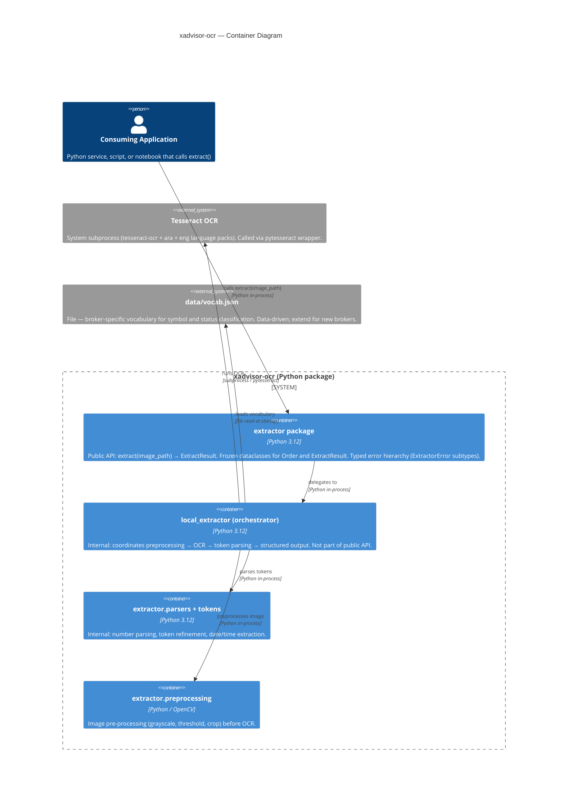

# xadvisor-ocr — C4 Container Diagram (L2)

> **Note**: this diagram was auto-generated by /handover on 2026-06-13 from repo signals (`README.md`, `extractor/__init__.py`, `local_extractor.py`, `.github/workflows/test.yml`). It is a **starting point** — review and refine.
>
> - Container labels and tech strings — the detector infers from package shape; adjust if the orchestration layer changes
> - Inferred relationships — Consumer → Library assumes in-process Python import; Tesseract is a subprocess call
> - External systems — only Tesseract detected; any LLM/cloud OCR integration (referenced in early git history but not in current package) won't appear here until re-added
>
> Update the "Maintenance" section below once the diagram is stable.

## Maintenance

(From the template — update when containers change, e.g. when `local_extractor.py` moves into the `extractor/` package, or if an LLM/cloud OCR backend is added.)
