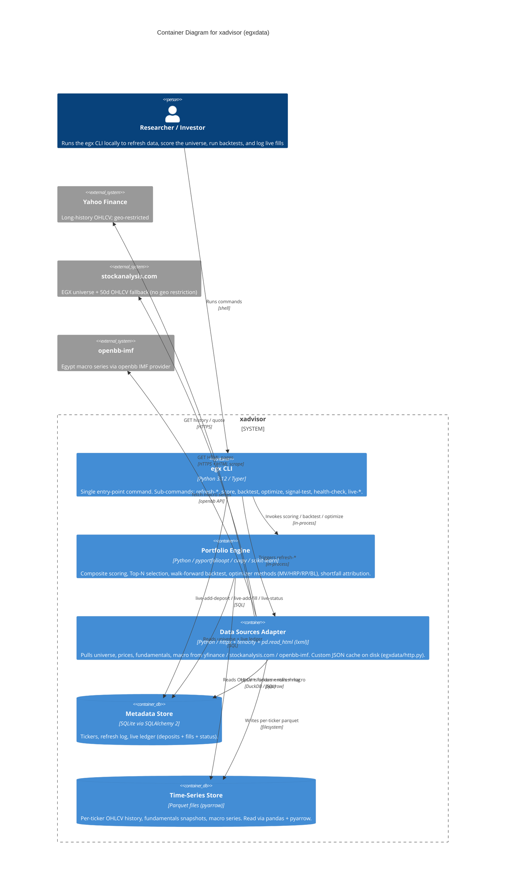

<!-- Source: ApexYard · templates/architecture/c4-container.md · github.com/me2resh/apexyard · MIT -->

# Container Diagram — xadvisor

> **C4 Level 2** — the system broken down into deployable/runnable containers. Audience: the dev team. One diagram per managed project; usually zoomed in from the L1 context diagram.

## Diagram

> **Note**: auto-generated by `/handover` on 2026-06-03; corrections applied 2026-06-06 after freshness check against `pyproject.toml` + `egxdata/sources/` + `egxdata/storage/`.
>
> - **Corrected**: `selectolax` and `hishel` were NOT present in the codebase — actual HTML parser is `pd.read_html` (lxml backend); actual HTTP cache is a custom JSON cache in `egxdata/http.py`. DuckDB was NOT used — parquet layer uses pandas + pyarrow.
> - **Corrected**: IMF source goes through `openbb-imf` library, not raw HTTPS/JSON.
> - No HTTP API, no background worker (synchronous CLI), no message queue — confirmed.
> - External systems: yfinance, stockanalysis.com, openbb-imf are the only sources in `egxdata/sources/`.

## Maintenance

(From the template — update when L2 containers change.)
