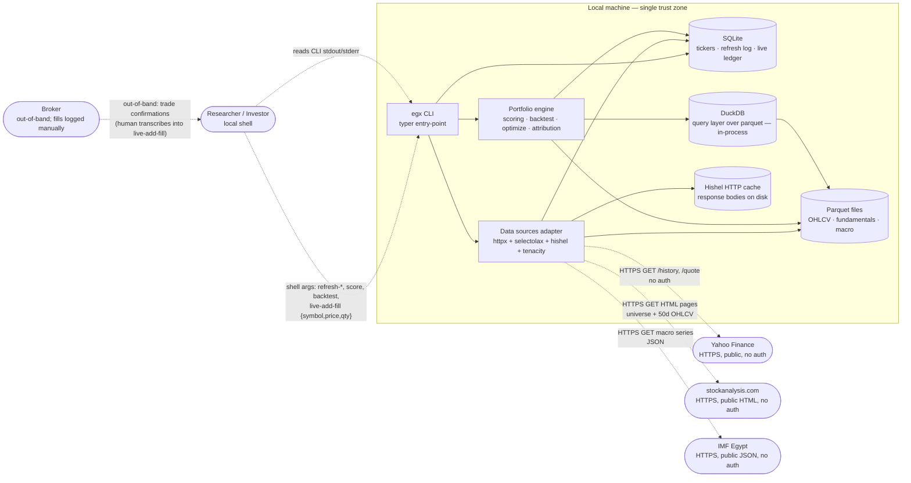

## DFD (snapshot as of 2026-06-03)

> **Point-in-time capture.** This is the DFD as it was when this threat model was enumerated. The live DFD evolves at `projects/xadvisor/architecture/dfd.md` — re-run `/threat-model` to refresh against current architecture. Future runs of this audit will snapshot the DFD as-it-was-then, not as-it-is-now.

## Trust boundaries

| Boundary | Crosses | Auth | Data classifications crossing |
|----------|---------|------|-------------------------------|
| **Local machine ↔ Public internet** | `sources → {yfin, sa, imf}` | NONE — public read-only endpoints | Public (market quotes, fundamentals, macro). No request body carries identifying or PII data. |
| **Researcher ↔ CLI** | `researcher → cli` (shell args + stdout) | OS user (local shell session) | PII: live-ledger writes (`live-add-deposit`, `live-add-fill`) carry the investor's personal trade detail. Stays inside the local trust zone. |
| **Broker ↔ Researcher** (out-of-band) | `broker → researcher` (paper confirms / app notifications), then `researcher → cli` | Broker's own auth (out of scope for this codebase) | PII: trade confirmations. The codebase never touches the broker API directly — fills are manually transcribed. |

Inside the **Local machine** zone, CLI / portfolio / sources / all stores share the same OS user's filesystem credentials. No internal sub-boundary modelled (no privilege separation, no daemon, no multi-tenant).

## Data classifications

| Element | Classification | Pathway | Evidence |
|---------|----------------|---------|----------|
| `ticker.symbol`, `ticker.name`, `ticker.sector` | **Public** | schema (SQLAlchemy) | `egxdata/storage/db.py` (universe table) |
| OHLCV per-ticker parquet (open/high/low/close/volume + date) | **Public** | schema (parquet columns) | `egxdata/storage/parquet.py` + `egxdata/sources/{yfin,stockanalysis}.py` |
| Fundamentals (earnings / shares / financials) | **Public** | schema (parquet columns) | `egxdata/sources/stockanalysis.py` |
| Macro series (FX, inflation, rates) | **Public** | schema (parquet columns) | `egxdata/sources/imf_egypt.py` |
| `live_deposit.amount`, `live_deposit.date` | **PII — investor financial** | inferred from semantics (personal capital flows) | `egxdata/portfolio/live.py` |
| `live_fill.symbol`, `live_fill.qty`, `live_fill.price`, `live_fill.date` | **PII — investor financial** | inferred from semantics (personal trade records) | `egxdata/portfolio/live.py` |
| `live_status.*` (current portfolio composition, cash, returns) | **PII — investor financial** | inferred from semantics | `egxdata/portfolio/live.py` |
| Hishel HTTP cache contents | **Public** (derived from public sources) | inferred from upstream classification | on-disk cache dir, gitignored |
| API keys / tokens / passwords | **N/A — none exist** | scan: `grep -rEi 'api[_-]?key\|password\|secret\|token' egxdata` returns zero hits | confirmed during `/handover` security scan |

**Explicit registry**: no `docs/data-classification.{md,yaml}` exists for this project. All classifications above are heuristic / semantic-inferred and may be tightened by adding an explicit registry.

---

## Attack surface

- **Entry points**: 1 CLI shell entry ( typer commands) + 3 inbound HTTP-response surfaces (yfinance JSON, stockanalysis HTML, IMF JSON).
- **Data stores**: 4 — SQLite (tickers + live ledger), Parquet (OHLCV/fundamentals/macro), DuckDB (query layer over parquet), Hishel HTTP cache (on-disk).
- **External integrations**: 3 unauthenticated HTTPS reads (yfinance, stockanalysis.com, IMF Egypt) + 1 out-of-band human-transcribed integration (broker fills).
- **Authentication / authorization surface**: NONE. No HTTP server, no auth provider, no API keys, no roles. Single OS-user trust zone.

## Threats by STRIDE category

| # | Category | Threat | Severity | Entry point | Mitigation |
|---|----------|--------|----------|-------------|------------|
| T1 | Tampering | Upstream HTML compromise (stockanalysis.com) injects bogus universe membership or OHLCV values; pipeline silently consumes the bad data and produces wrong portfolios | medium | `sources/stockanalysis.py → pd.read_html` (4 call sites) | Add contract tests against committed golden HTML fixtures (`tests/golden/` already exists); sanity-band assertions in `list_universe` (expect 30–50 EGX tickers) — fail-loudly if outside band |
| T2 | Tampering | `pd.read_html` is backed by lxml/html5lib parsing attacker-modifiable upstream HTML. lxml has had historical RCE / entity-expansion CVE classes | medium | `egxdata/sources/stockanalysis.py` lines 58, 87, 121, 151 | Keep `lxml>=5` floor (already in `pyproject.toml` — post-CVE-2024-fixes); pin html5lib floor; consider switching to `selectolax` (already declared dep, memory-safe lexbor C-core) — drops the lxml RCE class entirely |
| T3 | Info Disclosure | CLI stack traces leak local filesystem paths (`/home/<user>/...`) on errors; pollutes shared logs / screenshots / bug reports | low | typer's default error handler in `egxdata/cli.py` | Install a top-level `@app.callback` exception hook that strips paths in non-`--debug` mode; or accept and document the local-only audience |
| T4 | Info Disclosure | Live ledger sits as plain SQLite on disk. If user backs up workspace to non-encrypted cloud (Dropbox / iCloud / GitHub by mistake), investor PII (positions, fill prices, capital flows) leaks | low | `egxdata/portfolio/live.py` write paths | Document recommended encrypted-disk usage in README; gitignore the live-ledger DB path explicitly (verify `data/` is in `.gitignore` — confirmed: yes); consider `sqlcipher` for the live DB |
| T5 | DoS | `refresh-prices --symbols ALL` enumerates the full universe; a malicious upstream payload (pathological HTML / billion-laughs / multi-GB response) could OOM the process or hang the parse | low | `http.get_text` → `pd.read_html` | Set per-request byte cap on `httpx.Client` (`limits=httpx.Limits(max_response_size=10_000_000)`); lxml v5's huge_tree default + no-network entity resolution already mitigates entity-expansion; add a `--per-ticker-timeout` budget |
| T6 | Spoofing | MITM on outbound HTTPS to yfin/sa/imf — attacker would substitute responses; impacts data integrity (no auth involved, public endpoints) | low | `egxdata/http.py:86` `httpx.Client(...)` | Default `verify=True` is in place (verified: no `verify=False` anywhere); no further code change needed. Optional: pin certificate pins for the three upstream domains via `SSL_CERT_FILE` if threat model demands |
| T7 | Repudiation | Live ledger entries may lack `inserted_at` timestamp + source attribution. Single-user CLI so repudiation isn't a real adversarial concern; matters for the user's own historical reconstruction | low | `egxdata/portfolio/live.py` | Verify the live tables include `inserted_at TIMESTAMP NOT NULL DEFAULT CURRENT_TIMESTAMP` columns; if not, schema migration in next ledger version |
| T8 | Tampering | Hishel HTTP cache writes bodies + JSON meta to disk keyed by URL; attacker with local FS write can swap cached responses without integrity check | low | `egxdata/http.py` cache code paths | Out of scope by DFD trust-boundary definition (Local-machine zone, single OS user). Document the assumption; recommend `--no-cache` for sensitive runs |
| T9 | Supply chain | Wide native-binding dep surface (`cvxpy`, `scs`, `scikit-learn`, `lxml`, `html5lib`, `pyportfolioopt`). Not audited since adoption | medium | `pyproject.toml` declared deps | **Deferred to filed ticket [#4 on OmarElaraby26/xadvisor](https://github.com/OmarElaraby26/xadvisor/issues/4)** — `/audit-deps xadvisor` will produce a CVE triage |

Summary: 9 threats found — 0 critical, 0 high, 3 medium, 6 low.

## Recommended priority

1. **T9** — run `/audit-deps xadvisor` (ticket [#4](https://github.com/OmarElaraby26/xadvisor/issues/4) already filed). Highest-impact:lowest-effort.
2. **T1** — add a golden HTML fixture for `list_universe` + sanity-band assertion on row count (cheap; catches both upstream rot and active compromise).
3. **T2** — consider migrating the four `pd.read_html` call sites in `stockanalysis.py` to `selectolax` (already declared in deps but currently unused in `sources/`). Drops the lxml RCE-class exposure.
4. **T3–T8** — track in backlog; none gate any imminent shipping decision.

## OWASP cross-check

| Check | Status | Evidence |
|-------|--------|----------|
| SQL injection | PASS | All DB access via SQLAlchemy 2 ORM; `grep -rn "text(" egxdata --include='*.py'` returns zero hits |
| XSS | N/A | No HTML output; CLI tool |
| CSRF | N/A | No HTTP server, no forms |
| Insecure deserialization | PASS | No `pickle.load`, no `pickle.loads` anywhere in source; `grep -rn "pickle"` returns zero hits |
| XXE / XML entity attacks | LOW RISK | No `xml.etree` / `XMLParser` / `fromstring` usage; parsing is HTML via `pd.read_html` → lxml HTML parser (not XML), which doesn't resolve entities |
| Command injection | PASS | No `os.system`, no `subprocess`, no `eval`, no `exec` anywhere in source |
| Security misconfig | PASS | `httpx.Client` uses defaults (`verify=True`, `follow_redirects=True`, `timeout=30.0`); no `verify=False` anywhere |
| Vulnerable components | DEFERRED | `/audit-deps` ticket [#4](https://github.com/OmarElaraby26/xadvisor/issues/4) will run `pip-audit` / `safety` |
| Hardcoded secrets | PASS | `grep -rEi 'api[_-]?key\|password\|secret\|token' egxdata` returns zero hits; no `.env` files |
| Auth/Authz | N/A | Single-user CLI; no auth surface |

## Notes for the operator

- This is a **defender's-paradise** threat surface: no inbound auth, no PII over the wire, no multi-tenancy, no network listener, no `eval`/`pickle`/`subprocess`. The interesting threats (T1, T2) are about **upstream data integrity** and **HTML-parser supply-chain**, not classic web-app attack surface.
- The dominant risk to the project is NOT in the STRIDE table — it's the README's own framing: *"the real risk is premature confidence from well-structured noise"*. That's a research-methodology risk, not a security threat; STRIDE doesn't capture it.
- If the live-ledger workflow ever syncs to a server (broker API integration, multi-device sync), re-run `/dfd` + `/threat-model` — the trust model flips from single-user-local to network-service-with-auth, and the threat surface explodes.

